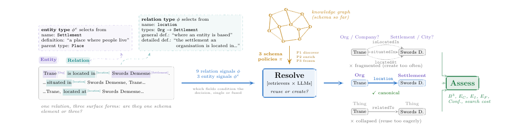

# SODA — Schema-Oriented Discovery and Assessment

Reference implementation for

> **Schema-Oriented Discovery and Intrinsic Quality Assessment in Open-Vocabulary
> Knowledge Graph Construction**
> Tuan C. Bui, An X. Nguyen, Dung N.H. Le, Trung D. Mai, Thang H. Bui, Tho T. Quan
> Ho Chi Minh City University of Technology (HCMUT), VNU-HCM

This repository was originally released as `edca` for an earlier submission of this work; both the
repository and the Python package inside it (now `soda/`) have since been renamed to match the
paper's current title. The pipeline stage names in the codebase below (Extract / Define /
Canonicalize / Assess) and the environment variables are otherwise unchanged from that release.

---

## What this is

Building a knowledge graph from text without a predefined schema turns on one decision, taken over and
over: when a relation is extracted, should the system **reuse** an existing schema element or **create**
a new one? Over-merging collapses distinct relations; over-creating fragments the schema into
near-duplicates. The decision is usually treated as a fixed pipeline component.

SODA treats it as a design variable. Its core, **Resolve** (retriever × LLM), makes the
reuse-or-create choice an explicit neuro-symbolic decision: a retriever proposes candidate schema
elements, an LLM chooses among them, and *what the LLM is shown about each candidate* is varied
systematically — **nine relation signals** spanning names, three definition styles, argument types and
embedding fusion, plus **three entity-type signals**. Each is studied under **three schema policies**
(discover from nothing, seed and enrich, seed and freeze) over a **shared extraction base**, so a
difference in the resulting graph is attributable to the signal rather than to extraction noise.

The framework also ships its own assessment stage, because a schema-free pipeline usually has no gold
graph to score against: clustering metrics for canonicalization quality, a per-stage error-attribution
funnel, and structural diagnostics that stay computable with no reference graph at all.

**Headline finding.** There is no universally best signal. A schema discovered from nothing rewards the
detailed and fused signals; a schema seeded with a reference rewards a concise definition on verbalized
inventories and a detailed typed one on Wikidata-style inventories. A per-stage error-attribution
comparison across policies (see the paper's §5.5) traces this reversal to two distinct roles a signal
plays: a *retrieval role* that populates the candidate pool early, and a *decision role* that
disambiguates among candidates once the pool is complete. Using greedy decoding and an off-the-shelf
embedder, SODA matches state-of-the-art schema-free construction without refinement, and with a stronger
open ≤9B backbone matches or exceeds it on two of three benchmarks while falling below on the third.

## Architecture



| stage | what it contributes |
|---|---|
| **Extract** (OIE) | open triples from raw text — the base every configuration shares |
| **Define** (SD) | symbolic descriptions for new schema elements: three definition styles and argument types. These are the fields a canonicalization signal selects from |
| **Canonicalize** (Resolve) | retrieve top-*k* candidates, then reuse or create. The stage under study |
| **Assess** | accuracy where a gold graph exists, plus canonicalization clustering metrics, stage-wise error attribution, and gold-free structural diagnostics |

One relation can surface three ways in the same corpus — *is located in*, *situated in*, *located at*.
Are they one schema element or three? Resolve makes that call explicitly, and makes the **information
the LLM sees while calling it** the variable: a relation signal φ selects among the name, three
definition styles and the argument types; an entity signal φᵉ selects among name, definition and parent
type. The retrieved candidates and the schema policy π condition the same decision, and Assess (right
of the figure) then scores all three outcomes.

The two ways the decision fails are opposite, and both are visible in the outcomes column above:
creating too often **fragments** the graph into near-duplicate relations, reusing too eagerly
**collapses** distinct ones. A single triple never shows which is happening, because the damage is to
the vocabulary the *next* document will be judged against — which is why the assessment stage scores
the schema, not just the triples.

## Repository layout

```
soda/                    the framework
  edc_framework.py         pipeline orchestration (stages, resume, checkpointing)
  extract.py               Extract  — open information extraction
  schema_definition.py     Define   — definitions and argument types
  schema_canonicalization.py  Canonicalize — the nine relation signals
  entity_canonicalization.py  Canonicalize — the three entity-type signals
  schema_retriever.py      candidate retrieval
  evaluate/                every metric over a run's output: span F1, aligned F1 and its
                           threshold sweep, B-cubed and its scaling reconstruction, OIE-miss
                           diagnosis and comparison, error attribution, structural diagnostics
  prompt_templates/        per-stage prompts (English and Vietnamese)
  few_shot_examples/       per-dataset demonstrations
runa.py                  entry point; the launchers below wrap it
run_soda.sh              the runner — every experiment is this under different env vars
run_smoke.sh             five-minute end-to-end check on a tiny fixture
run_eval.sh              evaluate a run that already exists on disk
run_backbone_headline.sh the headline backbone row
docs/                    the figure used by this README
schemas/                 gold schemas and the contributed typed entity-schema layer + its builders
datasets/                dataset builders and the small benchmark inputs
scripts/                 things that are not metrics: cross-run aggregation into tables, the
                         human-annotation study pipeline, resume/slicing tooling, unit tests,
                         and the launchers specific published numbers trace to
environment.yml          the pinned stack
```

## Install

```bash
conda env create -f environment.yml
conda activate soda
python -c "import nltk; nltk.download('punkt_tab')"
```

> The `punkt_tab` line cannot go in the YAML and is not optional. Without it the closed-schema
> evaluation scores every item `0.000` while B-cubed still looks normal, and nothing raises an error.

`environment.yml` pins the stack a working GPU box runs. `torch` is pinned to a CUDA 12.8 build; on a
different driver, change the `--extra-index-url` line to the matching wheel index and leave the rest.

## Quick start

A five-minute smoke test on a tiny English fixture, 4-bit so it fits a small card:

```bash
bash run_smoke.sh
```

It exercises the whole pipeline — extraction, definition, all nine relation signals, entity
canonicalization — and writes to `./output/example2_smoke_smoke/`.

## Running an experiment

Everything is driven by environment variables on a launcher. The main one:

```bash
MODEL_TAG=qwen3-8b OIE_MODEL=Qwen/Qwen3-8B \
EMB_TAG=bgem3 SC_EMBEDDER=BAAI/bge-m3 \
DATASET=webnlg RUN_MODE=1 USE_CLUSTER=false \
DATE_TAG=myrun \
bash run_soda.sh
```

| variable | default | meaning |
|---|---|---|
| `DATASET` | `webnlg` | `webnlg`, `rebel`, `wiki-nre` have gold graphs; others run intrinsic-only |
| `RUN_MODE` | `1` | schema policy: `1` discover, `2` seed and enrich, `3` seed and freeze |
| `OIE_MODEL` | `Qwen/Qwen3-8B` | one LLM shared by all stages |
| `MODEL_TAG` | `qwen3-8b` | folder tag — **must match** `OIE_MODEL` |
| `SC_EMBEDDER` | `BAAI/bge-m3` | the retrieval embedder |
| `EMB_TAG` | `bgem3` | folder tag — **must match** `SC_EMBEDDER` |
| `USE_CLUSTER` | `true` | `false` = per-item retrieval |
| `EDC_LOAD_IN_4BIT` | `0` | `1` for a large model on a small card |
| `DATE_TAG` | — | batch tag; keeps runs from overwriting one another |
| `RESUME_FROM` | `none` | `oie` / `sd` / `sc` to restart from a stage |
| `EDC_RESUME_INPLACE` | unset | with `RESUME_FROM`, continue **within** a stage from its checkpoint rather than from item 0 |

The output directory encodes the configuration, so runs never clobber each other:

```
output/{dataset}_selfcanon2_mode{N}_{item|itemcluster}_{MODEL_TAG}_{EMB_TAG}_{GPU_TAG}_{DATE_TAG}/iter0/
```

Inside `iter0/`: `oie_total.json` and `sd_total.json` (stage outputs, reusable by later runs),
`canon_kg_{case}.txt` and `canon_schema_{case}.json` for the nine signals, `entity_canon_ec*.json`
for the three entity signals, and after evaluation the `eval*/` directories.

### Resuming

Stages checkpoint as they go. `RESUME_FROM=sd EDC_RESUME_INPLACE=1` continues the Define stage from
its checkpoint instead of restarting it — on a 13k-item corpus that is the difference between ten hours
and forty.

### Evaluating an existing run

```bash
DATASET=webnlg METHOD=<method_string> ITER=iter0 bash run_eval.sh
```

## Reproducing the paper

Every experiment is the same runner under different environment variables, so they are given as
templates rather than as one script each. Four launchers ship: the runner itself, `run_eval.sh`,
`run_smoke.sh`, and `run_backbone_headline.sh` for the headline row.

**The 9×3 design-space grid** — nine signals are always computed in one pass, so only the policy and
the retrieval mode vary:

```bash
for MODE in 1 2 3; do
  for CLUSTER in false true; do
    DATASET=webnlg RUN_MODE=$MODE USE_CLUSTER=$CLUSTER DATE_TAG=grid \
    bash run_soda.sh
  done
done
```

**Backbone ablation** — one model per run; the tag must follow the model:

```bash
for M in "Qwen/Qwen3-8B:qwen3-8b" "Qwen/Qwen2.5-7B-Instruct:qwen2.5-7b" "google/gemma-2-9b-it:gemma2-9b"; do
  OIE_MODEL=${M%%:*} MODEL_TAG=${M##*:} EDC_LOAD_IN_4BIT=1 \
  EMB_TAG=minilm SC_EMBEDDER=sentence-transformers/all-MiniLM-L6-v2 \
  DATASET=webnlg RUN_MODE=3 USE_CLUSTER=false DATE_TAG=backbone \
  bash run_soda.sh
done
```

**Corpus-size scaling** — run the **full** cut once, then slice the smaller ones out of it. They are
prefix slices, not separate jobs, so a whole scaling row shares one provenance:

```bash
DATASET=webnlg_full_full RUN_MODE=1 USE_CLUSTER=false DATE_TAG=scale \
bash run_soda.sh

python datasets/slice_sc_results.py --full output/<the 13k iter0> \
       --model_tag qwen3-8b --sizes 1k=1000,3k=3000,6k=6000 --verify
```

> `--model_tag` is not optional: it defaults to `qwen3-8b`, so slicing a different backbone without it
> silently compares against the 8B runs and reports every cell as a mismatch.
> `--verify` reconstructs each cut and diffs it against a natively-run cell. **If a verify fails, the
> numbers are not reportable.**

**Seed variance** — sampling is confined to the Define stage so that the definition text is the only
source of variance:

```bash
for S in 1 2 3; do
  SD_TEMPERATURE=0.3 SEED=$S DATASET=webnlg RUN_MODE=1 USE_CLUSTER=false DATE_TAG=seeds \
  bash run_soda.sh
done
python scripts/aggregate_t7_seeds.py --out output/seed_summary.csv
```

**Vietnamese Edu-KG** — Mode 1 with native prompts; the corpus itself is not distributed (see below):

```bash
DATASET=edu_kg_core PROMPT_LANG=vni RUN_MODE=1 USE_CLUSTER=false \
EMB_TAG=bgem3 SC_EMBEDDER=BAAI/bge-m3 DATE_TAG=edukg \
bash run_soda.sh
```

The launchers under `scripts/` (`run_scale32b_p247.sh`, `run_wikinre_seeds_pod.sh`,
`run_p261_tau_and_q1.sh`, `eval_alignedf1_32b_13k.sh`) are kept verbatim because specific published
numbers trace to them.

## Not included in this repository

The documents and scripts here sometimes name files that are deliberately absent. Nothing is broken.

| absent | why |
|---|---|
| `datasets/hotpot*`, `musique*`, `trivia*` | third-party benchmarks, not redistributed. HotpotQA is CC BY-SA 4.0, whose share-alike does not sit under Apache-2.0. `datasets/build_graphrag_chunks.py` prepares the chunk form once you have them |
| the Vietnamese higher-education corpus | withheld under institutional terms. The **knowledge graph extracted from it** is released separately on Zenodo under CC-BY-4.0 |
| EDC's original few-shot and prompt files | available from the upstream repository named in [`NOTICE`](NOTICE) |
| the extrinsic KG-guided retrieval harness (the KG2RAG study of the paper) | that code patches and vendors parts of [KG2RAG](https://github.com/nju-websoft/KG2RAG), which is **GPLv3**. GPLv3 cannot be redistributed under Apache-2.0, so it is not shipped here. The SODA side of that study is reproducible from this repository: build the KG as usual, then apply the adapters against your own checkout of KG2RAG |
| GPU pod operations scripts | infrastructure for rented hardware, of no use elsewhere |

## Licence and attribution

Apache-2.0 — see [`LICENSE`](LICENSE).

This project is a derivative of the MIT-licensed **EDC** framework (Zhang and Soh, EMNLP 2024,
<https://github.com/clear-nus/edc>), substantially modified and extended, and it includes Apache-2.0
code from HuggingFace. Both notices are reproduced in [`NOTICE`](NOTICE); read it before redistributing.

## Citation

```bibtex
@article{soda2026,
  title   = {Schema-Oriented Discovery and Intrinsic Quality Assessment in
             Open-Vocabulary Knowledge Graph Construction},
  author  = {Bui, Tuan C. and Nguyen, An X. and Le, Dung N.H. and Mai, Trung D. and Bui, Thang H. and Quan, Tho T.},
  year    = {2026},
  note    = {Manuscript in preparation}
}
```

The released data (Vietnamese education KG and the typed entity-schema layer) is deposited separately;
cite it by its own DOI with the `[dataset]` tag.
